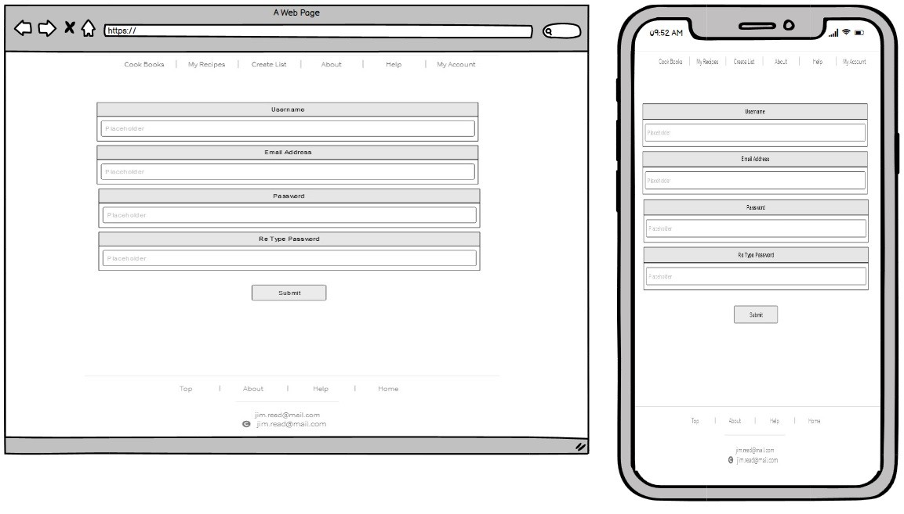

# CookBook Shopper

## Trello board
>
>
>>Link: https://trello.com/b/2m7qdc9N/cookbookshopper

## Overview

The main purpose of this API/APP is to solve a common problem I have that comes up from time to time when I need to do food shopping but more or less to speed up/cure laziness when doing this mundane yet pretty frequent activity.  The main purpose of the application is to store recipes.  A user can create an account, create recipes, read them, edit them, delete them.  These are user own creations and can be accessed anytime and anywhere, much like a recipe book.  To build on this, the api will have features available to the user to be able to grab a list of their favourite ones - say the user picks 7 recipes - 1 dinner for each day of the week.  The APP will return a condensed list of all ingredients the user needs to go buy.  Options can be added here to remove any items the client might already have.   This new list is something the user can just shop for and not have to think about the recipe when they go buy stuff.   Another feature that that the user can do is a connection to Coles or Woolworths api and payment gateways.  The Coles/Woollies online ordering isn’t the best and could do with some upgrades, however, now bringing in the automated (read lazy) part, if you choose multiple recipes - the app condenses the ingredients into one list for you - the APP/API will call your Coles/Woollies account, search for all the items and present the user with the most economical price/options to satisfy their choices.  Fields will be asked of when user needs them delivered, or go pick them up and payment options.   So basically, a simple interactive cook book where the user can add, edit, read, delete their recipes and store them in an ordered fashion (a dinner cookbook, dessert cookbook, soup cookbook, or have recipes sitting in the recipe list) via APP and store them in a database online API - The user will be able to collect a selection of recipes and print off a list of ingredients (note like ingredients stack so if 1 recipe has 500g of chicken thighs, and another 500gms - then it will state you will need 1kg of chicken thighs) and you can then go collect the items yourself.  Or alternatively, the user can push a few buttons and select time of delivery and payment and have the magic of the internet do its thing and have all the items dropped off at the door.   The algo used to drive the search to find the items in store will be grabbing cheaper or more economical options.  If you need 1.5kgs of chicken thighs and the supermarket only stocks 500gm or 2kgs packets, it will weigh up the cheaper option even if you end up with a little bit extra.  

## Install Steps

The app makes use of the venv pip package to create a virtual environment. Therefore the package will need to be installed in order to run the app. There after the install instructions are as below:

- Clone the repo: git clone https://github.com/brucemcclure/demo_app
- Change directory into the repo: cd demo_app
- Make sure venv is installed: pip install venv
- Create the virtual environment: python3 -m venv venv
- Activate the virtual environment: source venv/bin/activate
- Install the dependencies from requirments.txt: pip3 install -r requirements.txt
- Run the app: python src/main.py

## CI/CD
The CI/CD pipeline was created using Github Actions. It uses Python3.8, Pip3 and runs on the latest stable version of Ubuntu. The pipeline is started on a push to master.
Once it has pulled from master it installs the dependencies form requirements.txt and then it runs the tests in the tests directory.

## Wireframes

### Known missing wire frames

cookbook view/new mobile view

### Landing page

This is the webpage every user will see upon loading - features defined on page with a login and signup.  Feedback is temporary and might replace this
>The following will carrying over to other pages that gives a pleasing look/theme and feel to the overall website:
- colours
- fonts

Images selected should at least synch with the page content

### Login and signup

These are the webpages for both sign in and log in.

### User profile page

This is the users profile page, they can set up as much detail as they wish, they can edit or delete their account from here 

### Dashboard page

This is the users dashboard page when they log in.  They will see the last few recipes they have entered and the last modified recipe books.  Feedback is also on this page that can be sent.  Menu options will line the top and botton frames which are ersistant.  Users can create new recipes, lists, or books from here. Or view them.

An option to go shopping is available - this is a future update where a user can push their list to coles or woolworths API and order food through their account there.  

### Recipes Page

This webpage has two views, list and grid.  This will show the user all of their created recipes. They are able to click on them to view more details - and which they can choose to to move to a list or cookbook.  A search is located at the type for the user to simply type a name

The New recipe window will open asking for a name and description.  The first tab open by default will be ingredients tab. Click Continue will advance the tabs down asking the next questions as needed.  User can then add an image, save it to the recipes list, save to a cookbook, view it or discard it.

Note on mobile the display will be in list for recipes and cookbook.

Recipes view - list

Recipes view - Grid

Current Recipes on a list

Creating a new recipe on webpage

View Recipe - give options to add to list or cookbook

Mobile view of recipe builder and view of completed recipe and also a view when recipe it added to a list.

### Cook Book Page

This webpage shows all the user created cookbooks. Clicking on them will open a new window diplaying all the recipes in the book - which can be clicked on to view them.  The user can also start adding new recipes to the cookbook or remove them.  A search is located at the type for the user to simply type a name

The user can create new cookbooks, give them a name, picture.

Webpae view of cookbook - list

### Shopping List Page

This webpage is the shopping list page - all recipes that are added to the list appear on a list.  By default a new list must be created for the user to add recipes to it. Once created, it will exist until printed off, or saved, or a new list is created.

View current list - webp view

History of shopping lists - webview

create new shopping list - webview

Mobile view create/view/history

